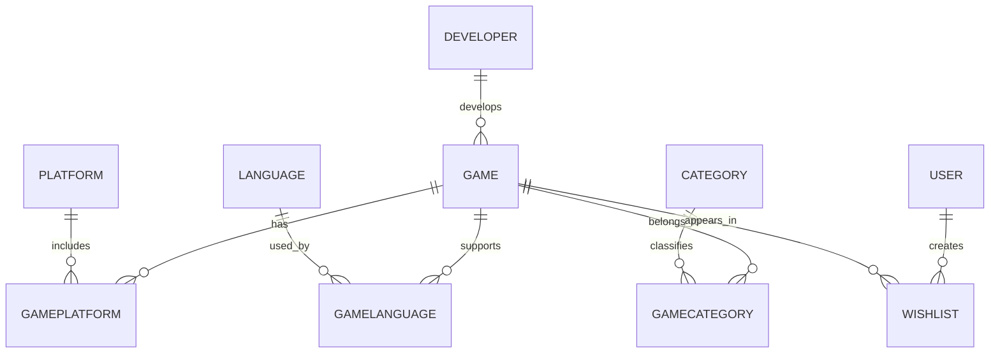

# Data Dogs — Video Game Database

A relational video game database built with **MySQL** as a database course group project. The project organizes game data sourced from **IGDB (Internet Game Database)** into a normalized relational schema and demonstrates SQL querying, data transformation, many-to-many relationships, stored procedures, functions, triggers, and audit logging.

## Project Overview

The database models video games and their relationships with developers, platforms, languages, categories, and users. It also includes a wishlist system and database automation for tracking rating changes and wishlist activity.

The project was designed to turn a large, less-structured game dataset into a relational database that can be queried and maintained efficiently.

## Technologies

- **MySQL 8.0+**
- **SQL**
- **MySQL Workbench**
- **Recursive CTEs**
- **Stored Procedures & Functions**
- **Database Triggers**
- **IGDB game data**

## Database Design

Main entities include:

- `Developer` — game developers
- `Game` — game names, ratings, rating counts, release dates, and developer relationships
- `Platform` — supported gaming platforms
- `Language` — supported languages
- `Category` — game genres/categories
- `User` — application users
- `Wishlist` — user-to-game wishlist relationships
- `GameRatingLog` — audit history for rating changes
- `WishlistLog` — audit history for deleted wishlist entries

Many-to-many relationships are handled through junction tables:

- `GamePlatform`
- `GameLanguage`
- `GameCategory`



## Key Features

### Data Normalization and Transformation

The project transforms imported game data into a normalized schema. SQL scripts extract developers, platforms, languages, and genres from the source data and populate their own relational tables.

Recursive CTEs are used to split multi-value fields such as:

- supported languages
- platforms
- game categories/genres

The resulting values are mapped back to individual games through junction tables.

### SQL Queries

`queries.sql` contains analytical queries including:

- most wishlisted games
- average game rating by developer
- oldest and newest release dates
- total games available per platform
- unique supported languages
- games rated above the database average
- wishlist item counts per user
- combined game/developer/rating summaries

The queries demonstrate concepts such as:

- `JOIN` and `LEFT JOIN`
- `GROUP BY`
- aggregate functions
- subqueries
- filtering and sorting
- `DISTINCT`
- string formatting

### Triggers and Automation

The database contains three triggers:

1. **`before_wishlist_insert`**  
   Automatically assigns the current date when a wishlist entry is inserted without a date.

2. **`log_rating_changes`**  
   Records changes to game ratings in `GameRatingLog`, including the previous rating, new rating, and timestamp.

3. **`after_wishlist_delete`**  
   Records deleted wishlist entries in `WishlistLog`.

### Stored Procedure

**`AddToWishlist`** adds a game to a user's wishlist only when that user/game combination does not already exist.

### Stored Function

**`GetUserWishlistCount`** returns the total number of games currently stored in a user's wishlist.

## Repository Structure

```text
.
├── data_dogs_dump.sql
├── schema_and_population.sql
├── queries.sql
├── triggers_functions_automation.sql
├── datadogs_Schema.mwb
└── README.md
```

### File Descriptions

| File | Description |
| --- | --- |
| `data_dogs_dump.sql` | Full MySQL database dump containing the database structure and data. |
| `schema_and_population.sql` | Creates the normalized schema and transforms/populates data from the imported game dataset. |
| `queries.sql` | Example analytical and reporting queries. |
| `triggers_functions_automation.sql` | Triggers, stored procedure, stored function, and tests for database automation. |
| `datadogs_Schema.mwb` | MySQL Workbench database model. |

## Running the Database

### Option 1 — Restore the Full Database Dump

With MySQL installed, import the dump from a terminal:

```bash
mysql -u root -p < data_dogs_dump.sql
```

The dump creates and uses the `data_dogs` database.

You can also import the file through **MySQL Workbench** using its Data Import/Restore tools.

### Option 2 — Review the Schema and Transformation Logic

`schema_and_population.sql` contains the SQL used to create the normalized tables and transform the imported source game data into the final schema.

> **Note:** The population portion expects the raw imported `games` source table to already exist. For the easiest complete setup, restore `data_dogs_dump.sql`.

## Example Query

```sql
-- Most wishlisted games
SELECT
    g.gameName,
    COUNT(w.wishlistID) AS timesWishlisted
FROM Game g
JOIN Wishlist w ON g.gameID = w.gameID
GROUP BY g.gameID, g.gameName
ORDER BY timesWishlisted DESC
LIMIT 20;
```

## Skills Demonstrated

- relational database design
- database normalization
- primary and foreign keys
- one-to-many and many-to-many relationships
- SQL data transformation
- recursive common table expressions (CTEs)
- joins and subqueries
- aggregate analysis
- stored procedures
- stored functions
- database triggers
- audit/log tables
- constraints and duplicate prevention
- MySQL database backup and restoration

## Data Source

Game data used in this academic project was sourced from **IGDB (Internet Game Database)**.

IGDB: https://www.igdb.com/

This repository is intended for educational and portfolio purposes. Game data and related intellectual property remain the property of their respective owners and data providers.

## Academic Project

This project was completed as a **group project for a database course** and is presented here as part of a technical portfolio.
